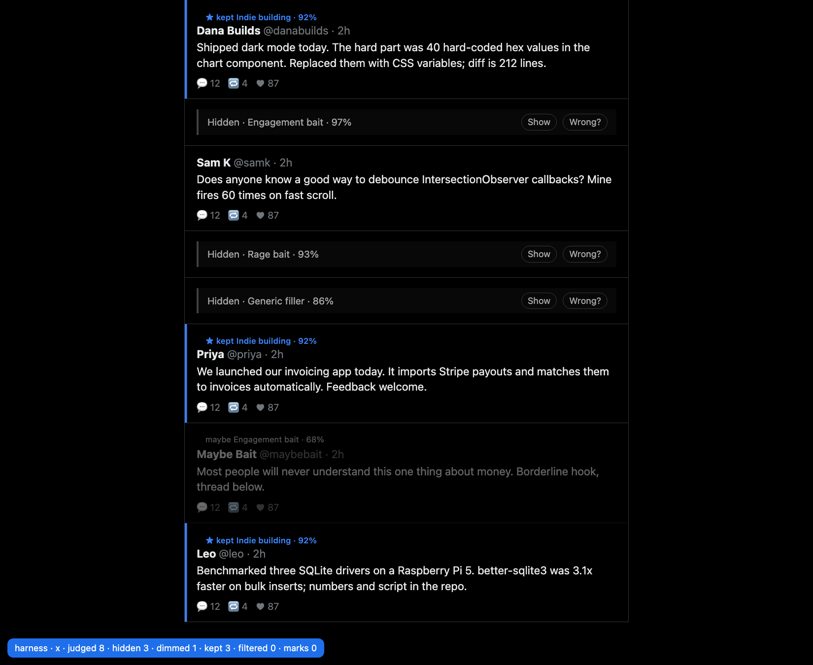
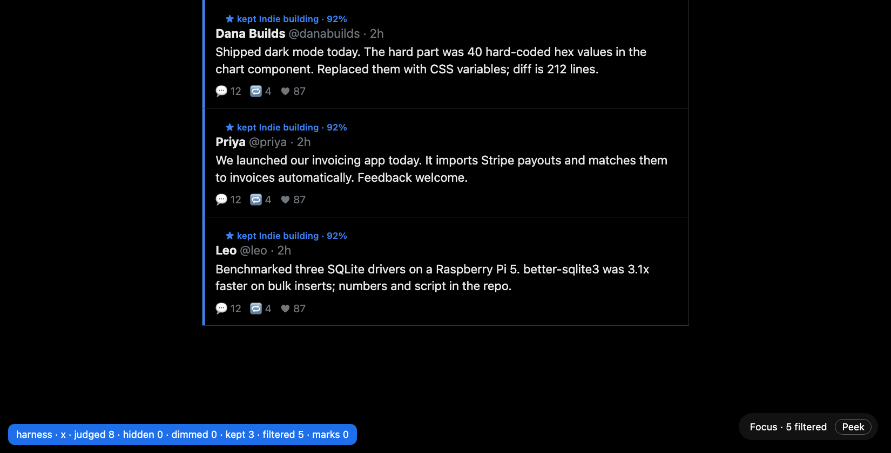
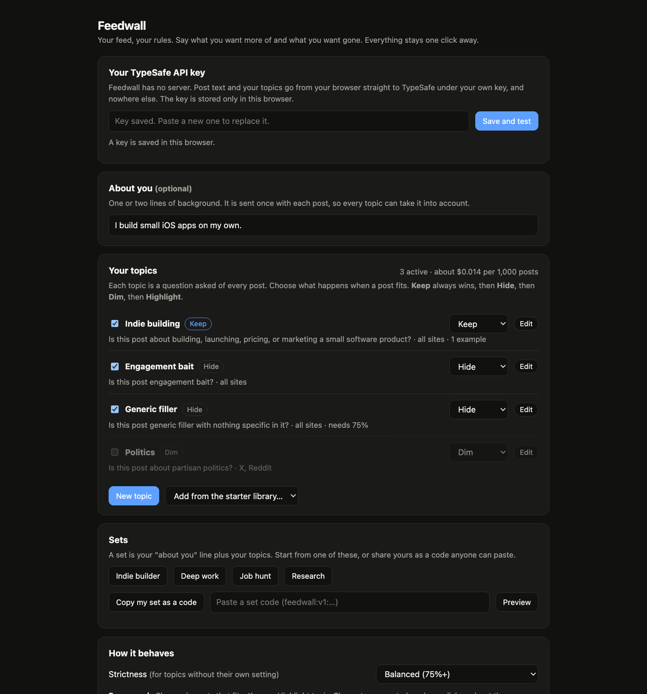

# Feedwall

**Your feed, your rules, in plain English.** Tell your browser what you want more of and what you want gone. Feedwall applies it on X, YouTube, Reddit, LinkedIn and Hacker News, keeps everything one click away, and shows you when it got it wrong.



*Screenshots are from the test bench in `tests/harness`, which runs the real content script against a fake feed.*

## Topics: you decide the classifications

A topic is a question asked of every post, written by you, with as much context as you care to give:

| | |
|---|---|
| **What are these posts?** | Posts sharing the result of a pricing change on a software product |
| **What counts** | Before-and-after numbers, what was tested |
| **What doesn't count** | General pricing advice with no result |
| **When a post fits** | Keep · Highlight · Dim · Hide |
| **Where, and how sure** | All sites or some; its own confidence bar |

Add as many as you like. An optional "about you" line gives every topic the same background. There is a starter library (engagement bait, rage bait, politics, generic filler, crypto promotion, hard sell, distressing news, indie building, technical depth, hiring) so you are never starting from a blank page.

When several topics fit the same post, the order is fixed so you can predict it: **Keep** always wins, then **Hide**, then **Dim**, then **Highlight**. A launch post that smells like a sales pitch stays visible if it fits a topic you chose to keep.

## Try a topic before you save it

**Test it on my recent posts** runs a draft topic over the last posts you actually scrolled past and shows what would fit at each confidence level, for a fraction of a cent. Vague wording shows up immediately: if nothing scores above 90%, the model does not know what you mean yet. Feedwall also checks your wording as you type, because the model reads it literally (negations, two topics in one, words like "interesting").

## Focus mode



Switch it on per site and only posts that fit a Keep or Highlight topic remain. The rest are counted in one chip, and **Peek** shows them dimmed. It can only filter what the site already loaded, so a focused feed is shorter and you will scroll more. If the model fails or you have no wanted topics, focus mode does nothing: it never blanks a feed.

## Sets you can share

A set is your "about you" line plus your topics. Start from a built-in one (Indie builder, Deep work, Job hunt, Research) or copy yours as a code that anyone can paste. Importing always shows a preview first, and everything in a set is treated as plain text.

## It shows its own mistakes



- **Wrong?** on a hidden post puts it back and records the mistake. The **Feedwall** button on any visible post lets you say "this fits one of my topics", and optionally teach it as an example.
- **How is it doing?** turns your marks into a per-topic report. Wrong too often at low confidence: it suggests a higher bar for that topic. Wrong at every confidence level: it tells you the wording is the problem.
- Marks export in [jevcal](https://github.com/abhixhek/jevcal)'s format to compute an exact threshold for a target accuracy.

## How it works

Every post heading toward your screen is sent, as plain text, to [Jev](https://typesafe.ai), a model that answers yes/no questions with a probability instead of writing text. Each topic is one question and all of them are answered in a single request. A language model would be too slow and too expensive to run on every post you scroll past; this kind of model answers in a few hundred milliseconds.

If anything fails (network, key, budget), the post is shown. Feedwall never hides something because it broke, and the popup tells you when requests are failing.

## Privacy

- No server, no account, no analytics. There is nothing of ours to send data to.
- Post text, your topics and your "about you" line go from your browser directly to TypeSafe, under **your own API key**. TypeSafe says it does not train on API requests; read [their terms](https://typesafe.ai/legal/privacy-policy).
- The key is stored in this browser only and is read only by the extension's background worker. Pages and content scripts never see it.
- Feedwall reads feed posts and comments. It skips direct messages, settings, login and compose pages.
- Details: [PRIVACY.md](PRIVACY.md).

## Install (from source)

1. Get a TypeSafe API key at [typesafe.ai](https://typesafe.ai).
2. Download or clone this repository.
3. Open `chrome://extensions`, switch on **Developer mode**, click **Load unpacked**, and pick the repository folder.
4. The settings page opens. Paste your key and press **Save and test**.
5. Pick a set or write a topic, open a feed, and scroll.

Works in Chrome, Edge, Brave and Arc. There is no build step.

## Cost

Input is billed at $0.042 per million tokens and output is free. Every topic's wording travels with every post, so cost grows with how much you write: five topics with context and an "about you" line measured about 700 tokens per post, roughly $0.03 per 1,000 posts. The settings page shows a live estimate for your own topics. Repeated posts are answered from a local cache for free, changing an action or a confidence bar never re-asks the model, and a daily request limit (default 3,000) makes the ceiling a guarantee.

## Status

v0.2. What has been verified and what has not:

| Piece | Status |
|---|---|
| Topics, decision order, sets, migration, cache, budget, fail-open, "Test it", counters under load | 31 automated tests (`npm test`) |
| Starter topics and user-written topics (with and without context) | Checked against the live TypeSafe API on sample posts (2026-09-18) |
| Content script: collapse, dim, keep/highlight, focus mode and Peek, teach menu, surviving React re-renders | Verified in the test bench for the X and Hacker News layouts |
| Extension on live X | v0.1 ran end to end on a real feed (2026-09-18). That run exposed X re-render bugs, fixed in v0.1.1; v0.2 has not yet been re-checked live |
| Known issue on X | After a collapse, X's virtualized list can keep stale spacing for posts further down until its next layout pass |
| Page selectors | Checked on the live pages of X, Hacker News, YouTube and LinkedIn (2026-09-18). Reddit is written from its documented structure and not yet checked live |

Sites change their markup. When the popup says "0 posts found on this page" on a feed, the adapter for that site needs a fix; each one is a few lines in [`src/content/adapters/sites.js`](src/content/adapters/sites.js).

## Layout

```
manifest.json
src/core/          topics, decisions, accuracy report (plain functions, tested in Node)
src/background.js  holds the key, calls the model, cache, budget, recent-posts buffer
src/content/       the page script, styles, and one adapter per site
src/ui/            popup and settings page
tests/             unit tests and the visual test bench
docs/PRODUCT.md    the product design and the reasoning behind each decision
```

Plain JavaScript, Manifest V3, no dependencies. A privacy tool should be readable in one sitting.

## Development

```bash
npm test                                  # unit tests
python3 -m http.server 8000               # then open:
# http://localhost:8000/tests/harness/index.html?site=x
# http://localhost:8000/tests/harness/index.html?site=x&focus=1
# http://localhost:8000/tests/harness/index.html?site=hackernews&eager=1
# http://localhost:8000/tests/harness/options.html
```

Not affiliated with TypeSafe AI, X, Google, Reddit, LinkedIn or Y Combinator. MIT licensed.
